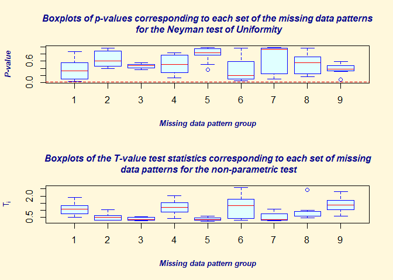
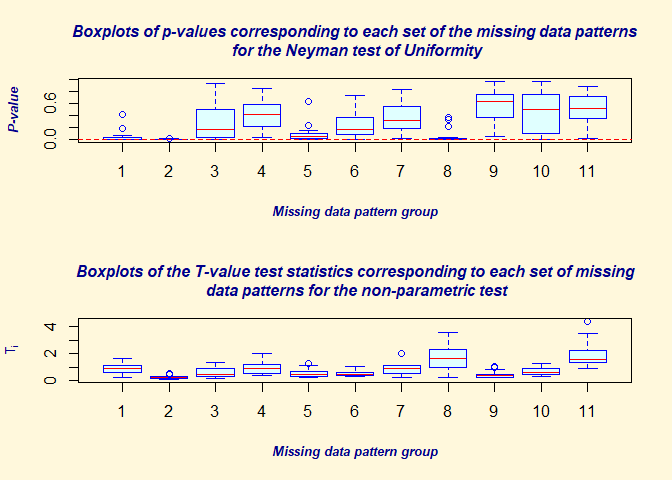
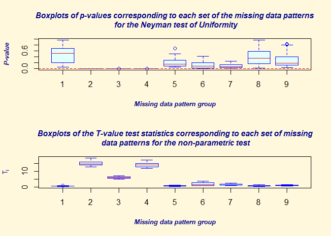
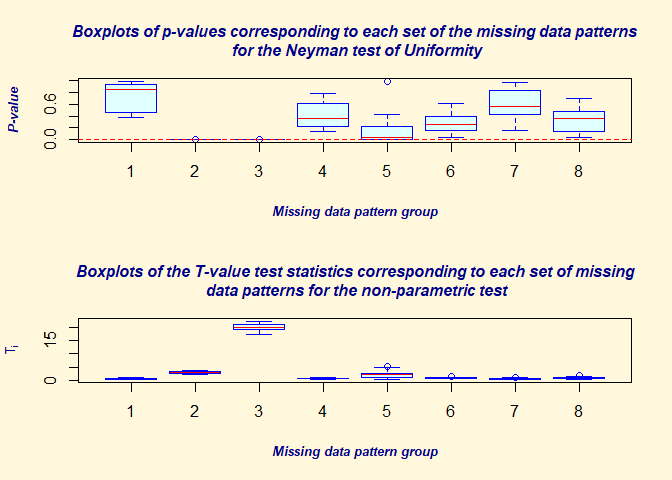

<!-- README.md is generated from README.Rmd. Please edit that file -->

# MissMech

<!-- badges: start -->
<!-- badges: end -->

The main purpose of this package is to test whether the missing data
mechanism, in a set of incompletely observed data, is one of missing
completely at random (MCAR). As a by-product, however, this package can
impute incomplete data, is able to perform a test to determine whether
data have a multivariate normal distribution or whether the covariances
for several populations are equal. The test of MCAR follows the
methodology proposed by Jamshidian and Jalal (2010).

It is based on testing equality of covariances between groups consisting
of identical missing data patterns. The data are imputed, using two
options of normality and distribution free, and the test of equality of
covariances between groups with identical missing data patterns is
performed also with options of assuming normality (Hawkins test) or
non-parametrically.

The user, can optionally use her own method of data imputation as well.
Multiple imputation is an option as a diagnostic tool to help identify
cases or variables that contribute to rejection of MCAR, when the MCAR
test is rejecetd (See Jamshidian and Jalal, 2010 for details).

As explained in Jamshidian, Jalal, and Jansen (2014), this package can
also be used for imputing missing data, test of multivariate normality,
and test of equality of covariances between several groups when data are
complete.

## Installation

You can install the released version of `MissMech` from CRAN with:

``` r
install.packages("MissMech")
```

ans also, you can install the development version of `MissMech` like so
from GitHub:

``` r
require("remotes")
remotes::install_github("indenkun/MissMech")
```

## Example

``` r
library(MissMech)
# -- Example 1: Data are MCAR and normally distributed
n <- 300
p <- 5
pctmiss <- 0.2
set.seed(1010)
y <- matrix(rnorm(n * p),nrow = n)
missing <- matrix(runif(n * p), nrow = n) < pctmiss
y[missing] <- NA
out <- TestMCARNormality(data=y)
print(out)
#> Call:
#> TestMCARNormality(data = y)
#> 
#> Number of Patterns:  9 
#> 
#> Total number of cases used in the analysis:  245 
#> 
#>  Pattern(s) used:
#>                                    Number of cases
#> group.1    1    1    1   NA    1                16
#> group.2    1    1   NA    1    1                23
#> group.3    1    1    1    1    1               101
#> group.4   NA    1    1    1    1                33
#> group.5    1   NA    1    1    1                22
#> group.6   NA   NA    1    1    1                 7
#> group.7    1    1    1    1   NA                21
#> group.8    1    1   NA    1   NA                10
#> group.9   NA    1    1    1   NA                12
#> 
#> 
#>     Test of normality and Homoscedasticity:
#>   -------------------------------------------
#> 
#> Hawkins Test:
#> 
#>     P-value for the Hawkins test of normality and homoscedasticity:  0.7444768 
#> 
#>     There is not sufficient evidence to reject normality
#>     or MCAR at 0.05 significance level

# --- Prints the p-value for both the Hawkins and the nonparametric test
summary(out)
#> 
#> Number of imputation:  1 
#> 
#> Number of Patterns:  9 
#> 
#> Total number of cases used in the analysis:  245 
#> 
#>  Pattern(s) used:
#>                                    Number of cases
#> group.1    1    1    1   NA    1                16
#> group.2    1    1   NA    1    1                23
#> group.3    1    1    1    1    1               101
#> group.4   NA    1    1    1    1                33
#> group.5    1   NA    1    1    1                22
#> group.6   NA   NA    1    1    1                 7
#> group.7    1    1    1    1   NA                21
#> group.8    1    1   NA    1   NA                10
#> group.9   NA    1    1    1   NA                12
#> 
#> 
#>     Test of normality and Homoscedasticity:
#>   -------------------------------------------
#> 
#> Hawkins Test:
#> 
#>     P-value for the Hawkins test of normality and homoscedasticity:  0.7444768 
#> 
#> Non-Parametric Test:
#> 
#>     P-value for the non-parametric test of homoscedasticity:  0.6543455

# --- Uses more cases
# out1 <- TestMCARNormality(data=y, del.lesscases = 1)
# print(out1)

#---- performs multiple imputation
Out <- TestMCARNormality (data = y, imputation.number = 10)
summary(Out)
#> 
#> Number of imputation:  10 
#> 
#> Number of Patterns:  9 
#> 
#> Total number of cases used in the analysis:  245 
#> 
#>  Pattern(s) used:
#>                                    Number of cases
#> group.1    1    1    1   NA    1                16
#> group.2    1    1   NA    1    1                23
#> group.3    1    1    1    1    1               101
#> group.4   NA    1    1    1    1                33
#> group.5    1   NA    1    1    1                22
#> group.6   NA   NA    1    1    1                 7
#> group.7    1    1    1    1   NA                21
#> group.8    1    1   NA    1   NA                10
#> group.9   NA    1    1    1   NA                12
#> 
#> 
#>     Test of normality and Homoscedasticity:
#>   -------------------------------------------
#> 
#> Hawkins Test:
#> 
#>     P-value for the Hawkins test of normality and homoscedasticity:  0.7444768 
#> 
#> Non-Parametric Test:
#> 
#>     P-value for the non-parametric test of homoscedasticity:  0.6543455
boxplot(Out)
```



``` r

#-- Example 2: Data are MCAR and non-normally distributed (t distributed with d.f. = 5)
n <- 300
p <- 5
pctmiss <- 0.2
set.seed(1010)
y <- matrix(rt(n * p, 5), nrow = n)
missing <- matrix(runif(n * p), nrow = n) < pctmiss
y[missing] <- NA
out <- TestMCARNormality(data=y)
print(out)
#> Call:
#> TestMCARNormality(data = y)
#> 
#> Number of Patterns:  11 
#> 
#> Total number of cases used in the analysis:  258 
#> 
#>  Pattern(s) used:
#>                                     Number of cases
#> group.1    NA    1    1    1    1                31
#> group.2     1    1    1    1    1               100
#> group.3     1    1    1   NA   NA                12
#> group.4     1    1    1   NA    1                20
#> group.5     1    1    1    1   NA                19
#> group.6     1   NA    1    1    1                23
#> group.7    NA   NA    1    1    1                 7
#> group.8     1   NA    1   NA    1                10
#> group.9     1    1   NA    1    1                20
#> group.10    1    1   NA    1   NA                 8
#> group.11   NA    1    1   NA    1                 8
#> 
#> 
#>     Test of normality and Homoscedasticity:
#>   -------------------------------------------
#> 
#> Hawkins Test:
#> 
#>     P-value for the Hawkins test of normality and homoscedasticity:  4.611948e-05 
#> 
#>     Either the test of multivariate normality or homoscedasticity (or both) is rejected.
#>     Provided that normality can be assumed, the hypothesis of MCAR is 
#>     rejected at 0.05 significance level. 
#> 
#> Non-Parametric Test:
#> 
#>     P-value for the non-parametric test of homoscedasticity:  0.5918666 
#> 
#>     Reject Normality at 0.05 significance level.
#>     There is not sufficient evidence to reject MCAR at 0.05 significance level.

# Perform multiple imputation
Out_m <- TestMCARNormality (data = y, imputation.number = 20)
boxplot(Out_m)
```



``` r

# One may impute the data using a method other than the methods available in the package
# MissMech. If object "yimputed" set to be imputed data using other methods, e.g. k nearest
# neighbor imputation, then in MissMech it can be implemented as follow
# See also Jamshidian, Jalal, and Jansen (2014) for more information.
# out_k <- TestMCARNormality(data = y, imputed.data = yimputed)
# print(out_k)

#-- Example 3: Data are MAR (not MCAR), but are normally distributed
n <- 300
p <- 5
r <- 0.3
mu <- rep(0, p)
sigma <- r * (matrix(1, p, p) - diag(1, p))+ diag(1, p)
set.seed(110)
eig <- eigen(sigma)
sig.sqrt <- eig$vectors %*%  diag(sqrt(eig$values)) %*%  solve(eig$vectors)
sig.sqrt <- (sig.sqrt + sig.sqrt) / 2
y <- matrix(rnorm(n * p), nrow = n) %*%  sig.sqrt
tmp <- y
for (j in 2:p){
  y[tmp[, j - 1] > 0.8, j] <- NA 
}
out <- TestMCARNormality(data = y, alpha =0.1)
print(out)
#> Call:
#> TestMCARNormality(data = y, alpha = 0.1)
#> 
#> Number of Patterns:  9 
#> 
#> Total number of cases used in the analysis:  277 
#> 
#>  Pattern(s) used:
#>                                   Number of cases
#> group.1   1    1    1   NA    1                19
#> group.2   1   NA    1    1    1                21
#> group.3   1    1    1    1    1               163
#> group.4   1    1   NA   NA    1                 8
#> group.5   1   NA    1    1   NA                 7
#> group.6   1   NA    1   NA   NA                 7
#> group.7   1    1   NA    1    1                25
#> group.8   1    1    1    1   NA                20
#> group.9   1    1   NA    1   NA                 7
#> 
#> 
#>     Test of normality and Homoscedasticity:
#>   -------------------------------------------
#> 
#> Hawkins Test:
#> 
#>     P-value for the Hawkins test of normality and homoscedasticity:  0.2262611 
#> 
#>     There is not sufficient evidence to reject normality
#>     or MCAR at 0.1 significance level

#-- Example 4: Multiple imputation; data are MAR (not MCAR), but are normally distributed
n <- 300
p <- 5
pctmiss <- 0.2
set.seed(1010)
y <- matrix (rnorm(n * p), nrow = n)
missing <- matrix(runif(n * p), nrow = n) < pctmiss
y[missing] <- NA
Out <- OrderMissing(y)
y <- Out$data
spatcnt <- Out$spatcnt
g2 <- seq(spatcnt[1] + 1, spatcnt[2])
g4 <- seq(spatcnt[3] + 1, spatcnt[4])
y[c(g2, g4), ] <- 2 * y[c(g2, g4), ]
out <- TestMCARNormality(data = y, imputation.number = 20)
print(out)
#> Call:
#> TestMCARNormality(data = y, imputation.number = 20)
#> 
#> Number of Patterns:  9 
#> 
#> Total number of cases used in the analysis:  245 
#> 
#>  Pattern(s) used:
#>                                    Number of cases
#> group.1    1    1    1   NA    1                16
#> group.2    1    1   NA    1    1                23
#> group.3    1    1    1    1    1               101
#> group.4   NA    1    1    1    1                33
#> group.5    1   NA    1    1    1                22
#> group.6   NA   NA    1    1    1                 7
#> group.7    1    1    1    1   NA                21
#> group.8    1    1   NA    1   NA                10
#> group.9   NA    1    1    1   NA                12
#> 
#> 
#>     Test of normality and Homoscedasticity:
#>   -------------------------------------------
#> 
#> Hawkins Test:
#> 
#>     P-value for the Hawkins test of normality and homoscedasticity:  4.361157e-16 
#> 
#>     Either the test of multivariate normality or homoscedasticity (or both) is rejected.
#>     Provided that normality can be assumed, the hypothesis of MCAR is 
#>     rejected at 0.05 significance level. 
#> 
#> Non-Parametric Test:
#> 
#>     P-value for the non-parametric test of homoscedasticity:  2.730253e-27 
#> 
#>     Hypothesis of MCAR is rejected at  0.05 significance level.
#>     The multivariate normality test is inconclusive.
boxplot(out)
```



``` r
# Removing Groups 2 and 4
y1= y[-seq(spatcnt[1]+1,spatcnt[2]),]
out <- TestMCARNormality(data=y1,imputation.number = 20)
print(out)
#> Call:
#> TestMCARNormality(data = y1, imputation.number = 20)
#> 
#> Number of Patterns:  8 
#> 
#> Total number of cases used in the analysis:  222 
#> 
#>  Pattern(s) used:
#>                                    Number of cases
#> group.1    1    1    1   NA    1                16
#> group.2    1    1    1    1    1               101
#> group.3   NA    1    1    1    1                33
#> group.4    1   NA    1    1    1                22
#> group.5   NA   NA    1    1    1                 7
#> group.6    1    1    1    1   NA                21
#> group.7    1    1   NA    1   NA                10
#> group.8   NA    1    1    1   NA                12
#> 
#> 
#>     Test of normality and Homoscedasticity:
#>   -------------------------------------------
#> 
#> Hawkins Test:
#> 
#>     P-value for the Hawkins test of normality and homoscedasticity:  3.214258e-15 
#> 
#>     Either the test of multivariate normality or homoscedasticity (or both) is rejected.
#>     Provided that normality can be assumed, the hypothesis of MCAR is 
#>     rejected at 0.05 significance level. 
#> 
#> Non-Parametric Test:
#> 
#>     P-value for the non-parametric test of homoscedasticity:  3.334175e-12 
#> 
#>     Hypothesis of MCAR is rejected at  0.05 significance level.
#>     The multivariate normality test is inconclusive.
boxplot(out)
```



``` r

#-- Example 5: Test of homoscedasticity for complete data
n <- 50
p <- 5
r <- 0.4
sigma <- r * (matrix(1, p, p) - diag(1, p)) + diag(1, p)
set.seed(1010)
eig <- eigen(sigma)
sig.sqrt <- eig$vectors %*%  diag(sqrt(eig$values)) %*%  solve(eig$vectors)
sig.sqrt <- (sig.sqrt + sig.sqrt) / 2
y1 <- matrix(rnorm(n * p), nrow = n) %*%  sig.sqrt
n <- 75
p <- 5
y2 <- matrix(rnorm(n * p), nrow = n)
n <- 25
p <- 5
r <- 0
sigma <- r * (matrix(1, p, p) - diag(1, p)) + diag(2, p)
y3 <- matrix(rnorm(n * p), nrow = n) %*%  sqrt(sigma)
ycomplete <- rbind(y1 ,y2 ,y3)
y1 [ ,1] <- NA
y2[,c(1 ,3)] <- NA
y3 [ ,2] <- NA
ygroup <- rbind(y1, y2, y3)
out <- TestMCARNormality(data = ygroup, method = "Hawkins", imputed.data = ycomplete)
print(out)
#> Call:
#> TestMCARNormality(data = ygroup, method = "Hawkins", imputed.data = ycomplete)
#> 
#> Number of Patterns:  3 
#> 
#> Total number of cases used in the analysis:  150 
#> 
#>  Pattern(s) used:
#>                                  Number of cases
#> group.1   NA    1    1   1   1                50
#> group.2   NA    1   NA   1   1                75
#> group.3    1   NA    1   1   1                25
#> 
#> 
#>     Test of normality and Homoscedasticity:
#>   -------------------------------------------
#> 
#> Hawkins Test:
#> 
#>     P-value for the Hawkins test of normality and homoscedasticity:  1.65588e-05

# ---- Example 6, real data
data(agingdata)
TestMCARNormality(agingdata, del.lesscases = 1)
#> Call:
#> TestMCARNormality(data = agingdata, del.lesscases = 1)
#> 
#> Number of Patterns:  20 
#> 
#> Total number of cases used in the analysis:  506 
#> 
#>  Pattern(s) used:
#>            education   income   support   coping   events   depression   Health
#> group.1            1        1         1        1        1            1        1
#> group.2            1       NA         1        1        1            1        1
#> group.3            1        1         1       NA        1            1        1
#> group.4            1        1         1       NA        1            1       NA
#> group.5            1        1         1       NA        1           NA        1
#> group.6            1        1         1        1        1           NA        1
#> group.7            1        1        NA        1        1            1        1
#> group.8            1        1         1        1        1            1       NA
#> group.9           NA        1         1        1        1            1        1
#> group.10           1        1        NA       NA        1           NA       NA
#> group.11           1        1        NA       NA        1            1        1
#> group.12           1        1        NA        1        1            1       NA
#> group.13          NA        1         1       NA        1            1        1
#> group.14           1        1         1        1       NA            1        1
#> group.15           1        1         1       NA       NA            1        1
#> group.16           1        1         1       NA       NA           NA        1
#> group.17          NA       NA         1       NA        1            1        1
#> group.18           1        1         1       NA       NA            1       NA
#> group.19           1       NA         1       NA        1            1        1
#> group.20          NA       NA         1       NA       NA           NA        1
#>            Number of cases
#> group.1                280
#> group.2                 10
#> group.3                 90
#> group.4                  3
#> group.5                 11
#> group.6                  6
#> group.7                 14
#> group.8                  5
#> group.9                  2
#> group.10                 3
#> group.11                 4
#> group.12                 2
#> group.13                 2
#> group.14                18
#> group.15                41
#> group.16                 5
#> group.17                 4
#> group.18                 2
#> group.19                 2
#> group.20                 2
#> 
#> 
#>     Test of normality and Homoscedasticity:
#>   -------------------------------------------
#> 
#> Hawkins Test:
#> 
#>     P-value for the Hawkins test of normality and homoscedasticity:  0.0001548743 
#> 
#>     Either the test of multivariate normality or homoscedasticity (or both) is rejected.
#>     Provided that normality can be assumed, the hypothesis of MCAR is 
#>     rejected at 0.05 significance level. 
#> 
#> Non-Parametric Test:
#> 
#>     P-value for the non-parametric test of homoscedasticity:  0.04552708 
#> 
#>     Hypothesis of MCAR is rejected at  0.05 significance level.
#>     The multivariate normality test is inconclusive.
```

Examples are detailed in Jamshidian, Jalal, and Jansen (2014).

For imptation using the K-nearest neighbor method, the paper uses the
`kNNImpute()` function from the `imputation` package, but the this
package has now been removed from CRAN.

## References

Jamshidian M, Jalal S. Tests of homoscedasticity, normality, and missing
completely at random for incomplete multivariate data. Psychometrika.
2010 Dec;75(4):649-674. <doi:10.1007/s11336-010-9175-3>.

Jamshidian, M., Jalal, S., & Jansen, C. (2014). MissMech: An R Package
for Testing Homoscedasticity, Multivariate Normality, and Missing
Completely at Random (MCAR). Journal of Statistical Software, 56(6),
1–31. <doi:10.18637/jss.v056.i06>.

## Note

The `MissMech` package was taken over by the current package maintainer
from the previous maintainer, Mortaza Jamshidian, and resubmitted to
conform to the current CRAN policy.

The basic code is the same as in the previous 1.0.2 versions.

Mortaza Jamshidian, package maintainer and author, has given me
permission to change the maintainer.

## Licence

GPL (\>= 2)
